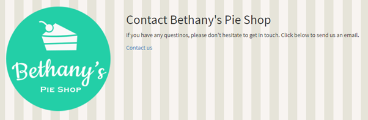

# .NET Core Introduction Labs

## Building a complete ASP.NET Core MVC 3.x application


In this hands-on lab, you’ll build the Bethany’s Pie Shop application yourself. Let’s get started!

## Table of contents

- [Setting up the site](#setting-up-the-site)
- [Creating the model](#creating-the-model)
- [Creating a Controller](#creating-a-controller)
- [Creating the View](#creating-the-view)
- [Creating a database with EF Core](#creating-a-database-with-ef-core)
- [Creating a Partial view](#creating-a-partial-view)
- [Creating the Shopping Cart](#creating-the-shopping-cart)
- [Creating the home page](#creating-the-home-page)
- [Creating a view component](#creating-a-view-component)
- [Creating a tag helper](#creating-a-tag-helper)
- [Adding the detail page and navigation](#adding-the-detail-page-and-navigation)
- [Creating the Order Form](#creating-the-order-form)
- [Adding ASP.NET Identity](#adding-aspnet-identity)

## Setting up the site

1.	Create a new Empty ASP.NET Core application, as shown below.


2.	In the new project, select the Startup.cs file and add MVC to the services collection. Note that depending on the version, this may already be there.

```csharp
    app.UseMvc();
```

3.	In the Configure method, ensure that the following code is in place.

```csharp
    if (env.IsDevelopment())
    {
        app.UseDeveloperExceptionPage();
    }
    else
    {
        app.UseExceptionHandler("/Home/Error");
    }
```

4.	We’ll need to add some default route in order to see just any page very soon. At the end of the `Configure()` method, add the following code to bring in an endpoint (what this does, will become clear soon).

```csharp
    app.UseEndpoints(endpoints =>
    {
        endpoints.MapControllerRoute(
            name: "categoryfilter",
            pattern: "Pie/{action}/{category?}",
            defaults: new { Controller = "Pie", action = "List" });

        endpoints.MapControllerRoute(
            name: "default",
            pattern: "{controller=Home}/{action=Index}/{id?}");
    });
```

5.	Create in the project a `Controllers` and `Views` folder.

## Creating the model

1.	Create a `Models` folder. In this folder, create the following classes: `Pie` and `Category`.

```csharp
    public class Pie
    {
        public int PieId { get; set; }
        public string Name { get; set; }
        public string ShortDescription { get; set; }
        public string LongDescription { get; set; }
        public string AllergyInformation { get; set; }
        public decimal Price { get; set; }
        public string ImageUrl { get; set; }
        public string ImageThumbnailUrl { get; set; }
        public bool IsPieOfTheWeek { get; set; }
        public bool InStock { get; set; }
        public int CategoryId { get; set; }
        public virtual Category Category { get; set; }
    }

    public class Category
    {
        public int CategoryId { get; set; }
        public string CategoryName { get; set; }
        public string Description { get; set; }
        public List<Pie> Pies { get; set; }
    }
```

2. Also create the `IPieRepository` and `ICategoryRepository` interfaces in the `Model` folder.

```csharp
    public interface IPieRepository
    {
        IEnumerable<Pie> Pies { get; }
        IEnumerable<Pie> PiesOfTheWeek { get; }
        Pie GetPieById(int pieId);
    }

    public interface ICategoryRepository
    {
        IEnumerable<Category> Categories { get; }
    }
```

3. We’re going to use mock data at this point. Create the following mock repo classes in your `Models` folder.

```csharp
    public class MockCategoryRepository: ICategoryRepository
    {
        public IEnumerable<Category> Categories
        {
            get
            {
                return new List<Category>
                {
                    new Category{CategoryId=1, CategoryName="Fruit pies", Description="All-fruity pies"},
                    new Category{CategoryId=2, CategoryName="Cheese cakes", Description="Cheesy all the way"},
                    new Category{CategoryId=3, CategoryName="Seasonal pies", Description="Get in the mood for a seasonal pie"}
                };
            }
        }
    }

    public class MockPieRepository: IPieRepository
    {
        private readonly ICategoryRepository _categoryRepository = new MockCategoryRepository();

        public IEnumerable<Pie> Pies
        {
            get
            {
                return new List<Pie>
                {
                    new Pie {PieId = 1, Name="Strawberry Pie", Price=15.95M, ShortDescription="Lorem Ipsum", LongDescription="Icing carrot cake jelly-o cheesecake. Sweet roll marzipan marshmallow toffee brownie brownie candy tootsie roll. Chocolate cake gingerbread tootsie roll oat cake pie chocolate bar cookie dragée brownie. Lollipop cotton candy cake bear claw oat cake. Dragée candy canes dessert tart. Marzipan dragée gummies lollipop jujubes chocolate bar candy canes. Icing gingerbread chupa chups cotton candy cookie sweet icing bonbon gummies. Gummies lollipop brownie biscuit danish chocolate cake. Danish powder cookie macaroon chocolate donut tart. Carrot cake dragée croissant lemon drops liquorice lemon drops cookie lollipop toffee. Carrot cake carrot cake liquorice sugar plum topping bonbon pie muffin jujubes. Jelly pastry wafer tart caramels bear claw. Tiramisu tart pie cake danish lemon drops. Brownie cupcake dragée gummies.", Category = _categoryRepository.Categories.ToList()[0],ImageUrl="https://gillcleerenpluralsight.blob.core.windows.net/files/strawberrypie.jpg", InStock=true, IsPieOfTheWeek=false, ImageThumbnailUrl="https://gillcleerenpluralsight.blob.core.windows.net/files/strawberrypiesmall.jpg"},
                    new Pie {PieId = 2, Name="Cheese cake", Price=18.95M, ShortDescription="Lorem Ipsum", LongDescription="Icing carrot cake jelly-o cheesecake. Sweet roll marzipan marshmallow toffee brownie brownie candy tootsie roll. Chocolate cake gingerbread tootsie roll oat cake pie chocolate bar cookie dragée brownie. Lollipop cotton candy cake bear claw oat cake. Dragée candy canes dessert tart. Marzipan dragée gummies lollipop jujubes chocolate bar candy canes. Icing gingerbread chupa chups cotton candy cookie sweet icing bonbon gummies. Gummies lollipop brownie biscuit danish chocolate cake. Danish powder cookie macaroon chocolate donut tart. Carrot cake dragée croissant lemon drops liquorice lemon drops cookie lollipop toffee. Carrot cake carrot cake liquorice sugar plum topping bonbon pie muffin jujubes. Jelly pastry wafer tart caramels bear claw. Tiramisu tart pie cake danish lemon drops. Brownie cupcake dragée gummies.", Category = _categoryRepository.Categories.ToList()[1],ImageUrl="https://gillcleerenpluralsight.blob.core.windows.net/files/cheesecake.jpg", InStock=true, IsPieOfTheWeek=false, ImageThumbnailUrl="https://gillcleerenpluralsight.blob.core.windows.net/files/cheesecakesmall.jpg"},
                    new Pie {PieId = 3, Name="Rhubarb Pie", Price=15.95M, ShortDescription="Lorem Ipsum", LongDescription="Icing carrot cake jelly-o cheesecake. Sweet roll marzipan marshmallow toffee brownie brownie candy tootsie roll. Chocolate cake gingerbread tootsie roll oat cake pie chocolate bar cookie dragée brownie. Lollipop cotton candy cake bear claw oat cake. Dragée candy canes dessert tart. Marzipan dragée gummies lollipop jujubes chocolate bar candy canes. Icing gingerbread chupa chups cotton candy cookie sweet icing bonbon gummies. Gummies lollipop brownie biscuit danish chocolate cake. Danish powder cookie macaroon chocolate donut tart. Carrot cake dragée croissant lemon drops liquorice lemon drops cookie lollipop toffee. Carrot cake carrot cake liquorice sugar plum topping bonbon pie muffin jujubes. Jelly pastry wafer tart caramels bear claw. Tiramisu tart pie cake danish lemon drops. Brownie cupcake dragée gummies.", Category = _categoryRepository.Categories.ToList()[0],ImageUrl="https://gillcleerenpluralsight.blob.core.windows.net/files/rhubarbpie.jpg", InStock=true, IsPieOfTheWeek=true, ImageThumbnailUrl="https://gillcleerenpluralsight.blob.core.windows.net/files/rhubarbpiesmall.jpg"},
                    new Pie {PieId = 4, Name="Pumpkin Pie", Price=12.95M, ShortDescription="Lorem Ipsum", LongDescription="Icing carrot cake jelly-o cheesecake. Sweet roll marzipan marshmallow toffee brownie brownie candy tootsie roll. Chocolate cake gingerbread tootsie roll oat cake pie chocolate bar cookie dragée brownie. Lollipop cotton candy cake bear claw oat cake. Dragée candy canes dessert tart. Marzipan dragée gummies lollipop jujubes chocolate bar candy canes. Icing gingerbread chupa chups cotton candy cookie sweet icing bonbon gummies. Gummies lollipop brownie biscuit danish chocolate cake. Danish powder cookie macaroon chocolate donut tart. Carrot cake dragée croissant lemon drops liquorice lemon drops cookie lollipop toffee. Carrot cake carrot cake liquorice sugar plum topping bonbon pie muffin jujubes. Jelly pastry wafer tart caramels bear claw. Tiramisu tart pie cake danish lemon drops. Brownie cupcake dragée gummies.", Category = _categoryRepository.Categories.ToList()[2],ImageUrl="https://gillcleerenpluralsight.blob.core.windows.net/files/pumpkinpie.jpg", InStock=true, IsPieOfTheWeek=true, ImageThumbnailUrl="https://gillcleerenpluralsight.blob.core.windows.net/files/pumpkinpiesmall.jpg"}
                };
            }
        }

        public IEnumerable<Pie> PiesOfTheWeek { get; }
        public Pie GetPieById(int pieId)
        {
            throw new System.NotImplementedException();
        }
    }
```

4. We need to register these repos as services within the Services collection of the application. In the `Startup` class, you can do this using the following code.

```csharp
    services.AddScoped<ICategoryRepository, MockCategoryRepository>();
    services.AddScoped<IPieRepository, MockPieRepository>();
```

## Creating a Controller

1. Create a new controller in the `Controllers` folder: `PieController`. This class needs to inherit from the base `Controller` class.

2. The controller will work with the repo classes. Create 2 fields to capture these locally.

```csharp
    private readonly IPieRepository _pieRepository;
    private readonly ICategoryRepository _categoryRepository;
```

3. These will be filled in using Dependency Injection (DI) using constructor injection. You can do this as follows.

```csharp
    public PieController(IPieRepository pieRepository, ICategoryRepository categoryRepository)
    {
        _pieRepository = pieRepository;
        _categoryRepository = categoryRepository;
    }
```

4. Create the first `List` action method, which will simply return a list of pies.

```csharp
    public ViewResult List()
    {
        return View(_pieRepository.Pies);
    }
```

## Creating the View

1. At this point, the application will compile but it won’t be running just yet, since we don’t have a view to go with that. Let’s do that next. Create a `Pie` folder as subfolder in the `Views` folder and in there, create the `List.cshtml` view. Add the following code.

```html
    <html>
        <head>
            <meta charset="utf-8">
            <meta http-equiv="X-UA-Compatible" content="IE=edge">
            <meta name="viewport" content="width=device-width, initial-scale=1">
            <title>Bethany's Pie Shop</title>

        </head>
        <body>

        </body>
    </html>
```

2. Add the following code in the first line of `List.cshtml` so that the view will be typed in the `Pie` class.

```csharp
    @model IEnumerable<BethanysPieShop.Models.Pie>
```

3. Now, add some Razor code inside the `<body>...</body>` tag.

```csharp
    @foreach (var pie in Model)
    {
        <div>
            <h2>@pie.Name</h2>
            <h3>@pie.Price.ToString("c")</h3>
            <h4>@pie.Category.CategoryName</h4>
        </div>
    }
```

4. Start the application and try browsing to your first page: `/Pie/List`

5. Add in the `PieController`'s `List` method some extra data for the view to display:

```csharp
    ViewBag.CurrentCategory = "Cheese cakes";
```

6. Display this in an `<h1>` header in the view.

```html
    <h1>@ViewBag.CurrentCategory</h1>
```

7. We’ll need to display some more data in one go. Add a viewmodel in the `ViewModels` folder named `PieListViewModel`

8. Add the following code to this class:

```csharp
    public class PiesListViewModel
    {
        public IEnumerable<Pie> Pies { get; set; }
        public string CurrentCategory { get; set; }
    }
```

9. Change the code in the `PieController` to use the `PieListViewModel`

```csharp
    PiesListViewModel piesListViewModel = new PiesListViewModel();
    piesListViewModel.Pies = _pieRepository.Pies;

    piesListViewModel.CurrentCategory = "Cheese cakes";

    return View(piesListViewModel);
```

10. Update the model for the view:

```csharp
    @model BethanysPieShop.ViewModels.PiesListViewModel
```

11. And update the view html code:

```html
    <h1>@Model.CurrentCategory</h1>

    @foreach (var pie in Model.Pies)
    {
        <div>
            <h2>@pie.Name</h2>
            <h3>@pie.Price.ToString("c")</h3>
            <h4>@pie.Category.CategoryName</h4>
        </div>
    }
```

12. Now we’ll create some general view files. If not yet there, create a `Shared` folder under `Views`.
In this folder, create a new view called `_Layout.cshtml` and add the following code.

```html
    <!DOCTYPE html>

    <html>
    <head>
        <meta name="viewport" content="width=device-width" />
        <link rel="stylesheet" type="text/css" href="https://fonts.googleapis.com/css?family=Source+Sans+Pro">
        <link href="~/lib/bootstrap/css/bootstrap.css" rel="stylesheet" />
        <link href="~/Content/site.css" rel="stylesheet" />
        <script src="~/lib/jquery/jquery.js"></script>
        <script src="~/lib/bootstrap/js/bootstrap.js"></script>
        <title>Bethany's Pie Shop</title>
    </head>
    <body>
        <div class="container">
            <div class="row">
                <div class="col-md-3">
                    <p class="lead">
                        
                    </p>
                </div>
                <div class="col-md-9">
                    @RenderBody()
                </div>
            </div>
        </div>
    </body>
    </html>
```

13.	From the [assets](./assets) folder in this repository, copy the `Images` folder to the `wwwroot/Images` folder in the project.

14. Now, update your view so that it only still contains the actual view code.

```html
    @model BethanysPieShop.ViewModels.PiesListViewModel

    <h1>@Model.CurrentCategory</h1>

    @foreach (var pie in Model.Pies)
    {
        <div>
            <h2>@pie.Name</h2>
            <h3>@pie.Price.ToString("c")</h3>
            <h4>@pie.Category.CategoryName</h4>
        </div>
    }
```

15. Add a `ViewStart` file to the `Views` folder. Make sure its contents is as follows:

```csharp
@{
    Layout = "_Layout";
}
```

16. Run your application now. You should see the following.


17. You may have seen that we were referencing `Bootstrap` and `jQuery`. Although these aren’t the focus of this course, we will use `Bootstrap` for some basic styling of the site. `Bootstrap` and `jQuery` aren’t referenced by default since we started from the empty template. Let’s do that next.


You can add packages using the new _Library Manager (libman)_ in Visual Studio. On the project, right-click and select _Add -> Client-side library_. In the dialog that appears, type `Twitter-Bootstrap@3.3.7`. In the target location, make sure to set `wwwroot/lib/bootstrap`.


Repeat this process for `jQuery`. Visual Studio will add a file named `libman.json` to the project and download the correct files into the application, so you can continue working!


18. Add a file named `Site.css` file to the `wwwroot/Content` folder. Add the following code to it.

```css
    /*!
    * Start Bootstrap - Shop Homepage (http://startbootstrap.com/)
    * Copyright 2013-2016 Start Bootstrap
    * Licensed under MIT (https://github.com/BlackrockDigital/startbootstrap/blob/gh-pages/LICENSE)
    */

    body {
        padding-top: 70px; /* Required padding for .navbar-fixed-top. Remove if using .navbar-static-top. Change if height of navigation changes. */
        background-image: url('/images/pattern.png');
        background-repeat: repeat;
        font-family: 'Source Sans Pro', sans-serif;
    }


    .slide-image {
        width: 100%;
    }

    .carousel-holder {
        margin-bottom: 30px;
    }

    .carousel-control,
    .item {
        border-radius: 4px;
    }

    .caption {
        height: 130px;
        overflow: hidden;
    }

        .caption h4 {
            white-space: nowrap;
        }

    .thumbnail img {
        width: 100%;
    }

    .addToCart {
        padding-right: 10px;
        padding-left: 10px;
    }

    .thumbnail {
        padding: 0;
    }

        .thumbnail .caption-full {
            padding: 9px;
            color: #333;
        }

    footer {
        margin: 50px 0;
    }

    .navbar {
        background-image: none;
    }

    .navbar-inverse {
        background-color: #a593c2;
        border-color: #a593c2;
    }

    .nav.navbar-nav.navbar-right li a {
        color: white;
        font-size: 1.2em;
    }

    .navbar .nav > li > a {
        font-size: 1.2em;
        text-shadow: 0 -1px 0 rgba(0, 0, 0, 0.25);
        color: white;
    }

    .carousel .item {
        height: 400px;
    }

    .item img {
        position: absolute;
        top: 0;
        left: 0;
        min-height: 400px;
    }

    .btn-primary:hover, .btn-primary:focus, .btn-primary:active, .btn-primary.active, .open .dropdown-toggle.btn-primary {
        background-color: #fcaeae !important;
        border-color: #fba1a1 !important;
    }

    .btn {
        background-color: #fcaeae !important;
        border-color: #fba1a1 !important;
    }
```

19. Update the `_Layout.cshtml` file so it now uses `Bootstrap` and `jQuery`.

```html
    <div class="container">
        <div class="row">
            <div class="col-md-3">
                <p class="lead">
                    
                </p>
            </div>
            <div class="col-md-9">
                @RenderBody()
            </div>
        </div>
    </div>
```

20. Also update the tile code for each `Pie` in the `List.cshtml`:

```html
    <div class="col-sm-4 col-lg-4 col-md-4">
        <div class="thumbnail">
            
            <div class="caption">
                <h3 class="pull-right">@pie.Price.ToString("c")</h3>
                <h3>
                    <a>@pie.Name</a>
                </h3>
                <p>@pie.ShortDescription</p>
            </div>
        </div>
    </div>
```

21. Run the site again now, it’ll look a lot better already at this point!


## Creating a database with EF Core

1. To use `Entity Framework`, since ASP.NET Core 3.0, we need to bring in some packages. Using NuGet, add a reference to:

```
    Microsoft.EntityFrameworkCore.SqlServer
    Microsoft.EntityFrameworkCore.Tools
```

2. In your `Model` folder, create a class `AppDbContext`:

```csharp
    public class AppDbContext : DbContext
    {
        public AppDbContext(DbContextOptions<AppDbContext> options) : base(options)
        {

        }
    }
```

3. Add the following so that the context will later create these tables.

```csharp
public DbSet<Pie> Pies { get; set; }
public DbSet<Category> Categories { get; set; }
```

4. Change your `appsettings.json` so that it contains the connectionstring. We’re using `LocalDb` here, this can be just any database:

```json
    {
    "ConnectionStrings": {
        "DefaultConnection": "Server=(localdb)\\MSSQLLocalDB;Database=BethanysPieShop7774;Trusted_Connection=True;MultipleActiveResultSets=true"
    }
    }
```

5. We now need to configure our app so that it supports `EF Core`. We’ll start by reading out the config file in the `Startup` class constructor. Since ASP.NET Core 2.0, ASP.NET reads out the file automatically if you give it the default name (`appsettings.json`). Add therefore the following code in your `Startup` class.

```csharp
    public Startup(IConfiguration configuration)
    {
        Configuration = configuration;
    }
    public IConfiguration Configuration { get; }
```

6. We’ll need to add code to the `ConfigureServices` method so that the `AddDbContext` method will add the required services for supporting `Entity Framework`:

```csharp
    services.AddDbContext<AppDbContext>(options =>
        options.UseSqlServer(Configuration.GetConnectionString("DefaultConnection")));
```

7. Create a new class named `PieRepository` that will use the actual database and implement the `IPieRepository`:

```csharp
    public class PieRepository: IPieRepository
    {
        private readonly AppDbContext _appDbContext;

        public PieRepository(AppDbContext appDbContext)
        {
            _appDbContext = appDbContext;
        }

        public IEnumerable<Pie> Pies
        {
            get
            {
                return _appDbContext.Pies.Include(c => c.Category);
            }
        }

        public IEnumerable<Pie> PiesOfTheWeek
        {
            get
            {
                return _appDbContext.Pies.Include(c => c.Category).Where(p => p.IsPieOfTheWeek);
            }
        }

        public Pie GetPieById(int pieId)
        {
            return _appDbContext.Pies.FirstOrDefault(p => p.PieId == pieId);
        }
    }
```

8. Create the `CategoryRepository` in the same way:

```csharp
    public class CategoryRepository : ICategoryRepository
    {
        private readonly AppDbContext _appDbContext;

        public CategoryRepository(AppDbContext appDbContext)
        {
            _appDbContext = appDbContext;
        }
        public IEnumerable<Category> Categories => _appDbContext.Categories;
    }
```

9. Change your `Startup` class so that it now uses these new repo classes instead of the _mock_ repositories:

```csharp
services.AddTransient<IPieRepository, PieRepository>();
services.AddTransient<ICategoryRepository, CategoryRepository>();
```

10. If we now run the app, we don’t have a database yet. We’ll create one next. Go to the _Package Manager Console_ and execute `Add-Migration Initial`. Perform a build first!

11. Next, run `Update-Database`. Your database should now be created. 

12.	Run the app and browse to your list page. You won’t see any data yet. Why? Well, we have a database but we don’t have any data just yet. So let’s create new data in our database.

13.	Go back to the `DbContext` class and we’ll make use of the `HasData` method that was introduced with _ASP.NET Core 2.1_. Using this method, as part of the migration, data can be inserted into the database.

```csharp
    protected override void OnModelCreating(ModelBuilder modelBuilder)
    {
        base.OnModelCreating(modelBuilder);

        //seed categories
        modelBuilder.Entity<Category>().HasData(new Category { CategoryId = 1, CategoryName = "Fruit pies" });
        modelBuilder.Entity<Category>().HasData(new Category { CategoryId = 2, CategoryName = "Cheese cakes" });
        modelBuilder.Entity<Category>().HasData(new Category { CategoryId = 3, CategoryName = "Seasonal pies" });

        //seed pies

        modelBuilder.Entity<Pie>().HasData(new Pie
        {
            PieId = 1,
            Name = "Apple Pie",
            Price = 12.95M,
            ShortDescription = "Our famous apple pies!",
            LongDescription =
                "Icing carrot cake jelly-o cheesecake. Sweet roll marzipan marshmallow toffee brownie brownie candy tootsie roll. Chocolate cake gingerbread tootsie roll oat cake pie chocolate bar cookie dragée brownie. Lollipop cotton candy cake bear claw oat cake. Dragée candy canes dessert tart. Marzipan dragée gummies lollipop jujubes chocolate bar candy canes. Icing gingerbread chupa chups cotton candy cookie sweet icing bonbon gummies. Gummies lollipop brownie biscuit danish chocolate cake. Danish powder cookie macaroon chocolate donut tart. Carrot cake dragée croissant lemon drops liquorice lemon drops cookie lollipop toffee. Carrot cake carrot cake liquorice sugar plum topping bonbon pie muffin jujubes. Jelly pastry wafer tart caramels bear claw. Tiramisu tart pie cake danish lemon drops. Brownie cupcake dragée gummies.",
            CategoryId = 1,
            ImageUrl = "https://gillcleerenpluralsight.blob.core.windows.net/files/applepie.jpg",
            InStock = true,
            IsPieOfTheWeek = true,
            ImageThumbnailUrl = "https://gillcleerenpluralsight.blob.core.windows.net/files/applepiesmall.jpg",
            AllergyInformation = ""
        });

        modelBuilder.Entity<Pie>().HasData(new Pie
        {
            PieId = 2,
            Name = "Blueberry Cheese Cake",
            Price = 18.95M,
            ShortDescription = "You'll love it!",
            LongDescription =
                "Icing carrot cake jelly-o cheesecake. Sweet roll marzipan marshmallow toffee brownie brownie candy tootsie roll. Chocolate cake gingerbread tootsie roll oat cake pie chocolate bar cookie dragée brownie. Lollipop cotton candy cake bear claw oat cake. Dragée candy canes dessert tart. Marzipan dragée gummies lollipop jujubes chocolate bar candy canes. Icing gingerbread chupa chups cotton candy cookie sweet icing bonbon gummies. Gummies lollipop brownie biscuit danish chocolate cake. Danish powder cookie macaroon chocolate donut tart. Carrot cake dragée croissant lemon drops liquorice lemon drops cookie lollipop toffee. Carrot cake carrot cake liquorice sugar plum topping bonbon pie muffin jujubes. Jelly pastry wafer tart caramels bear claw. Tiramisu tart pie cake danish lemon drops. Brownie cupcake dragée gummies.",
            CategoryId = 2,
            ImageUrl = "https://gillcleerenpluralsight.blob.core.windows.net/files/blueberrycheesecake.jpg",
            InStock = true,
            IsPieOfTheWeek = false,
            ImageThumbnailUrl =
                "https://gillcleerenpluralsight.blob.core.windows.net/files/blueberrycheesecakesmall.jpg",
            AllergyInformation = ""
        });

        modelBuilder.Entity<Pie>().HasData(new Pie
        {
            PieId = 3,
            Name = "Cheese Cake",
            Price = 18.95M,
            ShortDescription = "Plain cheese cake. Plain pleasure.",
            LongDescription =
                "Icing carrot cake jelly-o cheesecake. Sweet roll marzipan marshmallow toffee brownie brownie candy tootsie roll. Chocolate cake gingerbread tootsie roll oat cake pie chocolate bar cookie dragée brownie. Lollipop cotton candy cake bear claw oat cake. Dragée candy canes dessert tart. Marzipan dragée gummies lollipop jujubes chocolate bar candy canes. Icing gingerbread chupa chups cotton candy cookie sweet icing bonbon gummies. Gummies lollipop brownie biscuit danish chocolate cake. Danish powder cookie macaroon chocolate donut tart. Carrot cake dragée croissant lemon drops liquorice lemon drops cookie lollipop toffee. Carrot cake carrot cake liquorice sugar plum topping bonbon pie muffin jujubes. Jelly pastry wafer tart caramels bear claw. Tiramisu tart pie cake danish lemon drops. Brownie cupcake dragée gummies.",
            CategoryId = 2,
            ImageUrl = "https://gillcleerenpluralsight.blob.core.windows.net/files/cheesecake.jpg",
            InStock = true,
            IsPieOfTheWeek = false,
            ImageThumbnailUrl = "https://gillcleerenpluralsight.blob.core.windows.net/files/cheesecakesmall.jpg",
            AllergyInformation = ""
        });

        modelBuilder.Entity<Pie>().HasData(new Pie
        {
            PieId = 4,
            Name = "Cherry Pie",
            Price = 15.95M,
            ShortDescription = "A summer classic!",
            LongDescription =
                "Icing carrot cake jelly-o cheesecake. Sweet roll marzipan marshmallow toffee brownie brownie candy tootsie roll. Chocolate cake gingerbread tootsie roll oat cake pie chocolate bar cookie dragée brownie. Lollipop cotton candy cake bear claw oat cake. Dragée candy canes dessert tart. Marzipan dragée gummies lollipop jujubes chocolate bar candy canes. Icing gingerbread chupa chups cotton candy cookie sweet icing bonbon gummies. Gummies lollipop brownie biscuit danish chocolate cake. Danish powder cookie macaroon chocolate donut tart. Carrot cake dragée croissant lemon drops liquorice lemon drops cookie lollipop toffee. Carrot cake carrot cake liquorice sugar plum topping bonbon pie muffin jujubes. Jelly pastry wafer tart caramels bear claw. Tiramisu tart pie cake danish lemon drops. Brownie cupcake dragée gummies.",
            CategoryId = 1,
            ImageUrl = "https://gillcleerenpluralsight.blob.core.windows.net/files/cherrypie.jpg",
            InStock = true,
            IsPieOfTheWeek = false,
            ImageThumbnailUrl = "https://gillcleerenpluralsight.blob.core.windows.net/files/cherrypiesmall.jpg",
            AllergyInformation = ""
        });

        modelBuilder.Entity<Pie>().HasData(new Pie
        {
            PieId = 5,
            Name = "Christmas Apple Pie",
            Price = 13.95M,
            ShortDescription = "Happy holidays with this pie!",
            LongDescription =
                "Icing carrot cake jelly-o cheesecake. Sweet roll marzipan marshmallow toffee brownie brownie candy tootsie roll. Chocolate cake gingerbread tootsie roll oat cake pie chocolate bar cookie dragée brownie. Lollipop cotton candy cake bear claw oat cake. Dragée candy canes dessert tart. Marzipan dragée gummies lollipop jujubes chocolate bar candy canes. Icing gingerbread chupa chups cotton candy cookie sweet icing bonbon gummies. Gummies lollipop brownie biscuit danish chocolate cake. Danish powder cookie macaroon chocolate donut tart. Carrot cake dragée croissant lemon drops liquorice lemon drops cookie lollipop toffee. Carrot cake carrot cake liquorice sugar plum topping bonbon pie muffin jujubes. Jelly pastry wafer tart caramels bear claw. Tiramisu tart pie cake danish lemon drops. Brownie cupcake dragée gummies.",
            CategoryId = 3,
            ImageUrl = "https://gillcleerenpluralsight.blob.core.windows.net/files/christmasapplepie.jpg",
            InStock = true,
            IsPieOfTheWeek = false,
            ImageThumbnailUrl =
                "https://gillcleerenpluralsight.blob.core.windows.net/files/christmasapplepiesmall.jpg",
            AllergyInformation = ""
        });

        modelBuilder.Entity<Pie>().HasData(new Pie
        {
            PieId = 6,
            Name = "Cranberry Pie",
            Price = 17.95M,
            ShortDescription = "A Christmas favorite",
            LongDescription =
                "Icing carrot cake jelly-o cheesecake. Sweet roll marzipan marshmallow toffee brownie brownie candy tootsie roll. Chocolate cake gingerbread tootsie roll oat cake pie chocolate bar cookie dragée brownie. Lollipop cotton candy cake bear claw oat cake. Dragée candy canes dessert tart. Marzipan dragée gummies lollipop jujubes chocolate bar candy canes. Icing gingerbread chupa chups cotton candy cookie sweet icing bonbon gummies. Gummies lollipop brownie biscuit danish chocolate cake. Danish powder cookie macaroon chocolate donut tart. Carrot cake dragée croissant lemon drops liquorice lemon drops cookie lollipop toffee. Carrot cake carrot cake liquorice sugar plum topping bonbon pie muffin jujubes. Jelly pastry wafer tart caramels bear claw. Tiramisu tart pie cake danish lemon drops. Brownie cupcake dragée gummies.",
            CategoryId = 3,
            ImageUrl = "https://gillcleerenpluralsight.blob.core.windows.net/files/cranberrypie.jpg",
            InStock = true,
            IsPieOfTheWeek = false,
            ImageThumbnailUrl = "https://gillcleerenpluralsight.blob.core.windows.net/files/cranberrypiesmall.jpg",
            AllergyInformation = ""
        });

        modelBuilder.Entity<Pie>().HasData(new Pie
        {
            PieId = 7,
            Name = "Peach Pie",
            Price = 15.95M,
            ShortDescription = "Sweet as peach",
            LongDescription =
                "Icing carrot cake jelly-o cheesecake. Sweet roll marzipan marshmallow toffee brownie brownie candy tootsie roll. Chocolate cake gingerbread tootsie roll oat cake pie chocolate bar cookie dragée brownie. Lollipop cotton candy cake bear claw oat cake. Dragée candy canes dessert tart. Marzipan dragée gummies lollipop jujubes chocolate bar candy canes. Icing gingerbread chupa chups cotton candy cookie sweet icing bonbon gummies. Gummies lollipop brownie biscuit danish chocolate cake. Danish powder cookie macaroon chocolate donut tart. Carrot cake dragée croissant lemon drops liquorice lemon drops cookie lollipop toffee. Carrot cake carrot cake liquorice sugar plum topping bonbon pie muffin jujubes. Jelly pastry wafer tart caramels bear claw. Tiramisu tart pie cake danish lemon drops. Brownie cupcake dragée gummies.",
            CategoryId = 1,
            ImageUrl = "https://gillcleerenpluralsight.blob.core.windows.net/files/peachpie.jpg",
            InStock = false,
            IsPieOfTheWeek = false,
            ImageThumbnailUrl = "https://gillcleerenpluralsight.blob.core.windows.net/files/peachpiesmall.jpg",
            AllergyInformation = ""
        });

        modelBuilder.Entity<Pie>().HasData(new Pie
        {
            PieId = 8,
            Name = "Pumpkin Pie",
            Price = 12.95M,
            ShortDescription = "Our Halloween favorite",
            LongDescription =
                "Icing carrot cake jelly-o cheesecake. Sweet roll marzipan marshmallow toffee brownie brownie candy tootsie roll. Chocolate cake gingerbread tootsie roll oat cake pie chocolate bar cookie dragée brownie. Lollipop cotton candy cake bear claw oat cake. Dragée candy canes dessert tart. Marzipan dragée gummies lollipop jujubes chocolate bar candy canes. Icing gingerbread chupa chups cotton candy cookie sweet icing bonbon gummies. Gummies lollipop brownie biscuit danish chocolate cake. Danish powder cookie macaroon chocolate donut tart. Carrot cake dragée croissant lemon drops liquorice lemon drops cookie lollipop toffee. Carrot cake carrot cake liquorice sugar plum topping bonbon pie muffin jujubes. Jelly pastry wafer tart caramels bear claw. Tiramisu tart pie cake danish lemon drops. Brownie cupcake dragée gummies.",
            CategoryId = 3,
            ImageUrl = "https://gillcleerenpluralsight.blob.core.windows.net/files/pumpkinpie.jpg",
            InStock = true,
            IsPieOfTheWeek = true,
            ImageThumbnailUrl = "https://gillcleerenpluralsight.blob.core.windows.net/files/pumpkinpiesmall.jpg",
            AllergyInformation = ""
        });


        modelBuilder.Entity<Pie>().HasData(new Pie
        {
            PieId = 9,
            Name = "Rhubarb Pie",
            Price = 15.95M,
            ShortDescription = "My God, so sweet!",
            LongDescription =
                "Icing carrot cake jelly-o cheesecake. Sweet roll marzipan marshmallow toffee brownie brownie candy tootsie roll. Chocolate cake gingerbread tootsie roll oat cake pie chocolate bar cookie dragée brownie. Lollipop cotton candy cake bear claw oat cake. Dragée candy canes dessert tart. Marzipan dragée gummies lollipop jujubes chocolate bar candy canes. Icing gingerbread chupa chups cotton candy cookie sweet icing bonbon gummies. Gummies lollipop brownie biscuit danish chocolate cake. Danish powder cookie macaroon chocolate donut tart. Carrot cake dragée croissant lemon drops liquorice lemon drops cookie lollipop toffee. Carrot cake carrot cake liquorice sugar plum topping bonbon pie muffin jujubes. Jelly pastry wafer tart caramels bear claw. Tiramisu tart pie cake danish lemon drops. Brownie cupcake dragée gummies.",
            CategoryId = 1,
            ImageUrl = "https://gillcleerenpluralsight.blob.core.windows.net/files/rhubarbpie.jpg",
            InStock = true,
            IsPieOfTheWeek = true,
            ImageThumbnailUrl = "https://gillcleerenpluralsight.blob.core.windows.net/files/rhubarbpiesmall.jpg",
            AllergyInformation = ""
        });

        modelBuilder.Entity<Pie>().HasData(new Pie
        {
            PieId = 10,
            Name = "Strawberry Pie",
            Price = 15.95M,
            ShortDescription = "Our delicious strawberry pie!",
            LongDescription =
                "Icing carrot cake jelly-o cheesecake. Sweet roll marzipan marshmallow toffee brownie brownie candy tootsie roll. Chocolate cake gingerbread tootsie roll oat cake pie chocolate bar cookie dragée brownie. Lollipop cotton candy cake bear claw oat cake. Dragée candy canes dessert tart. Marzipan dragée gummies lollipop jujubes chocolate bar candy canes. Icing gingerbread chupa chups cotton candy cookie sweet icing bonbon gummies. Gummies lollipop brownie biscuit danish chocolate cake. Danish powder cookie macaroon chocolate donut tart. Carrot cake dragée croissant lemon drops liquorice lemon drops cookie lollipop toffee. Carrot cake carrot cake liquorice sugar plum topping bonbon pie muffin jujubes. Jelly pastry wafer tart caramels bear claw. Tiramisu tart pie cake danish lemon drops. Brownie cupcake dragée gummies.",
            CategoryId = 1,
            ImageUrl = "https://gillcleerenpluralsight.blob.core.windows.net/files/strawberrypie.jpg",
            InStock = true,
            IsPieOfTheWeek = false,
            ImageThumbnailUrl = "https://gillcleerenpluralsight.blob.core.windows.net/files/strawberrypiesmall.jpg",
            AllergyInformation = ""
        });

        modelBuilder.Entity<Pie>().HasData(new Pie
        {
            PieId = 11,
            Name = "Strawberry Cheese Cake",
            Price = 18.95M,
            ShortDescription = "You'll love it!",
            LongDescription =
                "Icing carrot cake jelly-o cheesecake. Sweet roll marzipan marshmallow toffee brownie brownie candy tootsie roll. Chocolate cake gingerbread tootsie roll oat cake pie chocolate bar cookie dragée brownie. Lollipop cotton candy cake bear claw oat cake. Dragée candy canes dessert tart. Marzipan dragée gummies lollipop jujubes chocolate bar candy canes. Icing gingerbread chupa chups cotton candy cookie sweet icing bonbon gummies. Gummies lollipop brownie biscuit danish chocolate cake. Danish powder cookie macaroon chocolate donut tart. Carrot cake dragée croissant lemon drops liquorice lemon drops cookie lollipop toffee. Carrot cake carrot cake liquorice sugar plum topping bonbon pie muffin jujubes. Jelly pastry wafer tart caramels bear claw. Tiramisu tart pie cake danish lemon drops. Brownie cupcake dragée gummies.",
            CategoryId = 2,
            ImageUrl = "https://gillcleerenpluralsight.blob.core.windows.net/files/strawberrycheesecake.jpg",
            InStock = false,
            IsPieOfTheWeek = false,
            ImageThumbnailUrl =
                "https://gillcleerenpluralsight.blob.core.windows.net/files/strawberrycheesecakesmall.jpg",
            AllergyInformation = ""
        });
    }
```

14. Create a new migration and run it on the database.

```
    Add-Migration add-data
    Update-Database
```

15. Run the app, you should now get in some real pies in the list!

## Creating a Partial view

1. We’re going to create a partial view. In the `Shared` folder, create a view called `PieOverviewSummary`. 

2. Make sure the model is strongly typed as a `Pie`:

```csharp
@model Pie
```

3. Add the following code:

```html
    <div class="col-sm-4 col-lg-4 col-md-4">
        <div class="thumbnail">
            
            <div class="caption">
                <h3 class="pull-right">@Model.Price.ToString("c")</h3>
                <h3>
                    <a asp-controller="Pie" asp-action="Details" asp-route-id="@Model.PieId">@Model.Name</a>
                </h3>
                <p>@Model.ShortDescription</p>
            </div>
            <div class="addToCart">
                <p class="button">
                    <a class="btn btn-primary" asp-controller="ShoppingCart" asp-action="AddToShoppingCart"
                    asp-route-pieId="@Model.PieId">Add to cart</a>
                </p>
            </div>
        </div>
    </div>
```

4. Update the `List.cshtml` so that it now uses this partial view:

```html
    @model BethanysPieShop.ViewModels.PiesListViewModel

    <h1>@Model.CurrentCategory</h1>

    @foreach (var pie in Model.Pies)
    {
        @Html.Partial("PieOverviewSummary", pie)
    }
```

5. Run the app, the result should be the same as before, but now with data coming from the database!

## Creating the Shopping Cart

1. Next, we are going to create the _Shopping Cart_. Start with the creation of the `ShoppingCartItem` class in your `Model` folder.

```csharp
    public class ShoppingCartItem
    {
        public int ShoppingCartItemId { get; set; }
        public Pie Pie { get; set; }
        public int Amount { get; set; }
        public string ShoppingCartId { get; set; }
    }
```

2. Update your `DBContext`: 

```csharp
    public DbSet<ShoppingCartItem> ShoppingCartItems { get; set; }
```

3. Add a database migration and update the database.

4. We’ll need to use the `Session` to work with the shopping cart. Getting hold of the `ISession` object is a little complicated. You have to obtain an instance of the `IHttpContextAccessor` service, which provides me with access to an `HttpContext` object that, in turn, provides me with the `ISession`. This around-about approach is required because the session isn’t provided as a regular service.

5.	Create the `ShoppingCart` as follows.

```csharp
    public class ShoppingCart
    {
        private readonly AppDbContext _appDbContext;
        private ShoppingCart(AppDbContext appDbContext)
        {
            _appDbContext = appDbContext;
        }

        public string ShoppingCartId { get; set; }

        public List<ShoppingCartItem> ShoppingCartItems { get; set; }

        public static ShoppingCart GetCart(IServiceProvider services)
        {
            ISession session = services.GetRequiredService<IHttpContextAccessor>()?
                .HttpContext.Session;

            var context = services.GetService<AppDbContext>();
            string cartId = session.GetString("CartId") ?? Guid.NewGuid().ToString();

            session.SetString("CartId", cartId);

            return new ShoppingCart(context) { ShoppingCartId = cartId };
        }

        public void AddToCart(Pie pie, int amount)
        {
            var shoppingCartItem =
                    _appDbContext.ShoppingCartItems.SingleOrDefault(
                        s => s.Pie.PieId == pie.PieId && s.ShoppingCartId == ShoppingCartId);

            if (shoppingCartItem == null)
            {
                shoppingCartItem = new ShoppingCartItem
                {
                    ShoppingCartId = ShoppingCartId,
                    Pie = pie,
                    Amount = 1
                };

                _appDbContext.ShoppingCartItems.Add(shoppingCartItem);
            }
            else
            {
                shoppingCartItem.Amount++;
            }
            _appDbContext.SaveChanges();
        }

        public int RemoveFromCart(Pie pie)
        {
            var shoppingCartItem =
                    _appDbContext.ShoppingCartItems.SingleOrDefault(
                        s => s.Pie.PieId == pie.PieId && s.ShoppingCartId == ShoppingCartId);

            var localAmount = 0;

            if (shoppingCartItem != null)
            {
                if (shoppingCartItem.Amount > 1)
                {
                    shoppingCartItem.Amount--;
                    localAmount = shoppingCartItem.Amount;
                }
                else
                {
                    _appDbContext.ShoppingCartItems.Remove(shoppingCartItem);
                }
            }

            _appDbContext.SaveChanges();

            return localAmount;
        }

        public List<ShoppingCartItem> GetShoppingCartItems()
        {
            return ShoppingCartItems ??
                    (ShoppingCartItems =
                        _appDbContext.ShoppingCartItems.Where(c => c.ShoppingCartId == ShoppingCartId)
                            .Include(s => s.Pie)
                            .ToList());
        }

        public void ClearCart()
        {
            var cartItems = _appDbContext
                .ShoppingCartItems
                .Where(cart => cart.ShoppingCartId == ShoppingCartId);

            _appDbContext.ShoppingCartItems.RemoveRange(cartItems);

            _appDbContext.SaveChanges();
        }


        public decimal GetShoppingCartTotal()
        {
            var total = _appDbContext.ShoppingCartItems.Where(c => c.ShoppingCartId == ShoppingCartId)
                .Select(c => c.Pie.Price * c.Amount).Sum();
            return total;
        }
    }
```

6. Also in the `Startup`, a change is needed:

```csharp
    services.AddSingleton<IHttpContextAccessor, HttpContextAccessor>();
    services.AddScoped<ShoppingCart>(sp => ShoppingCart.GetCart(sp));
```

7. In the `ConfigureServices` method in the `Startup`, we need to register the `Shopping` cart as well as using the `Session`:

```csharp
    services.AddMemoryCache();
    services.AddSession();
```

8.	In the `Configure`, add the following before the `UseMvc` call:

```csharp
    app.UseSession();
```

9.	Create the `ShoppingCartController` as follows:

```csharp
    public class ShoppingCartController : Controller
    {
        private readonly IPieRepository _pieRepository;
        private readonly ShoppingCart _shoppingCart;

        public ShoppingCartController(IPieRepository pieRepository, ShoppingCart shoppingCart)
        {
            _pieRepository = pieRepository;
            _shoppingCart = shoppingCart;
        }

        public ViewResult Index()
        {
            var items = _shoppingCart.GetShoppingCartItems();
            _shoppingCart.ShoppingCartItems = items;

            var shoppingCartViewModel = new ShoppingCartViewModel
            {
                ShoppingCart = _shoppingCart,
                ShoppingCartTotal = _shoppingCart.GetShoppingCartTotal()
            };

            return View(shoppingCartViewModel);
        }

        public RedirectToActionResult AddToShoppingCart(int pieId)
        {
            var selectedPie = _pieRepository.Pies.FirstOrDefault(p => p.PieId == pieId);

            if (selectedPie != null)
            {
                _shoppingCart.AddToCart(selectedPie, 1);
            }
            return RedirectToAction("Index");
        }

        public RedirectToActionResult RemoveFromShoppingCart(int pieId)
        {
            var selectedPie = _pieRepository.Pies.FirstOrDefault(p => p.PieId == pieId);

            if (selectedPie != null)
            {
                _shoppingCart.RemoveFromCart(selectedPie);
            }
            return RedirectToAction("Index");
        }
    }
```

10. Create the `ShoppingCartViewModel`:

```csharp
    public ShoppingCart ShoppingCart { get; set; }
    public  decimal ShoppingCartTotal { get; set; }
```

11. And now, create the View for the `ShoppingCart` in the correct folder. Add the following code to the view:

```html
    @model ShoppingCartViewModel

    <h2>Your shopping cart</h2>
    <h4>Here are the delicious pies in your shopping cart.</h4>
    <table class="table table-bordered table-striped">
        <thead>
            <tr>
                <th>Selected amount</th>
                <th>Pie</th>
                <th class="text-right">Price</th>
                <th class="text-right">Subtotal</th>
            </tr>
        </thead>
        <tbody>
            @foreach (var line in Model.ShoppingCart.ShoppingCartItems)
            {
                <tr>
                    <td class="text-center">@line.Amount</td>
                    <td class="text-left">@line.Pie.Name</td>
                    <td class="text-right">@line.Pie.Price.ToString("c")</td>
                    <td class="text-right">
                        @((line.Amount * line.Pie.Price).ToString("c"))
                    </td>
                </tr>
            }
        </tbody>
        <tfoot>
            <tr>
                <td colspan="3" class="text-right">Total:</td>
                <td class="text-right">
                    @Model.ShoppingCartTotal.ToString("c")
                </td>
            </tr>
        </tfoot>
    </table>
```

12. We can’t run use the _Shopping Cart_ just yet, we’ll do that later!

## Creating the home page

Use the snippets below to create the homepage yourself. If you have problems, consult the finished solution.

### `HomeController`

```csharp
    public class HomeController : Controller
    {
        private readonly IPieRepository _pieRepository;

        public HomeController(IPieRepository pieRepository)
        {
            _pieRepository = pieRepository;
        }

        public ViewResult Index()
        {
            var homeViewModel = new HomeViewModel
            {
                PiesOfTheWeek = _pieRepository.PiesOfTheWeek
            };

            return View(homeViewModel);
        }
    }
```

### `HomeViewModel`

```csharp
    public class HomeViewModel
    {
        public IEnumerable<Pie> PiesOfTheWeek { get; set; }
    }
```
	
### `Home\index.cshtml`

```html
    @model HomeViewModel

    @await Html.PartialAsync("Carousel")

    <h2>Pies of the week</h2>
    <h4>Our weekly selection - just for you!</h4>

    <div class="row">

        @foreach (var pie in Model.PiesOfTheWeek)
        {
            @Html.Partial("PieOfTheWeekSummary", pie)
        }

    </div>
```

### `Carousel.cshtml`

```html
    <div class="row carousel-holder">
        <div class="col-md-12">
            <div id="carousel-example-generic" class="carousel slide" data-ride="carousel">
                <ol class="carousel-indicators">
                    <li data-target="#carousel-example-generic" data-slide-to="0" class="active"></li>
                    <li data-target="#carousel-example-generic" data-slide-to="1"></li>
                    <li data-target="#carousel-example-generic" data-slide-to="2"></li>
                </ol>
                <div class="carousel-inner">
                    <div class="item active">
                        
                    </div>
                    <div class="item">
                        
                    </div>
                    <div class="item">
                        
                    </div>
                </div>
                <a class="left carousel-control" href="#carousel-example-generic" data-slide="prev">
                    <span class="glyphicon glyphicon-chevron-left"></span>
                </a>
                <a class="right carousel-control" href="#carousel-example-generic" data-slide="next">
                    <span class="glyphicon glyphicon-chevron-right"></span>
                </a>
            </div>
        </div>
    </div>
```

### `PieOfTheWeekSummary` (partial view)

```html
    @model Pie

    <div class="col-sm-4 col-lg-4 col-md-4">
        <div class="thumbnail">
            
            <div class="caption">
                <h3 class="pull-right">@Model.Price.ToString("c")</h3>
                <h3>
                    <a asp-controller="Pie" asp-action="Details" asp-route-id="@Model.PieId">@Model.Name</a>
                </h3>
                <p>@Model.ShortDescription</p>
            </div>
            <div class="addToCart">
                <p class="button">
                    <a class="btn btn-primary" asp-controller="ShoppingCart" asp-action="AddToShoppingCart"
                    asp-route-pieId="@Model.PieId">Add to cart</a>
                </p>
            </div>
        </div>
    </div>
```

## Creating a view component

1. Create a folder called `Components`.

2. Add a new class called `ShoppingCartSummary`. Let the class inherit from `ViewComponent`.

3. This component needs to work with the `ShoppingCart`, so we'll take it as a dependency in the contstructor:

```csharp
    public ShoppingCartSummary(ShoppingCart shoppingCart)
    {
        _shoppingCart = shoppingCart;
    }
```

4. In the `Invoke` method, add the following code. This will be invoked when the _View Component_ is used.

```csharp
public IViewComponentResult Invoke()
{
    var items = _shoppingCart.GetShoppingCartItems();
    _shoppingCart.ShoppingCartItems = items;

    var shoppingCartViewModel = new ShoppingCartViewModel
    {
        ShoppingCart = _shoppingCart,
        ShoppingCartTotal = _shoppingCart.GetShoppingCartTotal()

    };
    return View(shoppingCartViewModel);
}
```

5. Add a view called `Default.cshtml` in the `Shared\Components\ShoppingCartSummary` folder. Add the following code to this view.

```html
    @model ShoppingCartViewModel

    @if (Model.ShoppingCart.ShoppingCartItems.Count > 0)
    {
        <li>
            <a>
                <span class="glyphicon glyphicon-shopping-cart"></span>
                <span id="cart-status">
                    @Model.ShoppingCart.ShoppingCartItems.Count
                </span>
            </a>
        </li>
    }
```

6. Add a `nav` bar in your Layout for the creation of the menu:

```html
    <nav class="navbar navbar-inverse navbar-fixed-top" role="navigation">
        <div class="container">
            <div class="navbar-header">
                <button type="button" class="navbar-toggle" data-toggle="collapse" data-target="#bs-example-navbar-collapse-1">
                    <span class="sr-only">Toggle navigation</span>
                    <span class="icon-bar"></span>
                    <span class="icon-bar"></span>
                    <span class="icon-bar"></span>
                </button>
            </div>
            <div class="collapse navbar-collapse" id="bs-example-navbar-collapse-1">
                <ul class="nav navbar-nav">

                </ul>
            </div>
        </div>
    </nav>
```

7. Add the component inside the `ul` tag:

```csharp
    @await Component.InvokeAsync("ShoppingCartSummary")
```

8. In order to see the component work (as the _Shopping Cart_ itself doesn’t work yet), make a small change to the component code:

```csharp
var items = new List<ShoppingCartItem>() { new ShoppingCartItem(), new ShoppingCartItem() };
```

9. Run the app, you’ll see your component appear, as shown below.


## Creating a tag helper

1. We’ll now create a first _tag helper_. First, create a basic `Contact` page using an empty `ContactController` and a default view.

2. Create a folder `TagHelpers` and create a new class `EmailTagHelper`. Let the class inherit from `TagHelper`.

3. Add 2 custom properties on the tag helper.

```csharp
    public string Address { get; set; }
    public string Content { get; set; }
```

4. In the `Process` method, add the following code to create the HTML output.

```csharp
    public override void Process(TagHelperContext context, TagHelperOutput output)
    {
        output.TagName = "a";

        output.Attributes.SetAttribute("href", "mailto:" + Address);
        output.Content.SetContent(Content);
    }
```

5. With the component ready, now go to the `ViewImports` file and include your own tag helpers namespace:

```csharp
    @addTagHelper BethanysPieShop.TagHelpers.*, BethanysPieShop
```

6. Use the tag helper in your own `Contact` view:

```html
    <email address="info@@bethanyspieshop.com" content="Contact us"></email>
```

Make sure to compile your project before adding this code.



## Adding the detail page and navigation

Let’s now create the _Detail page_ for the application.

1. Go your `Startup` class. You’ll see there the default route you added in the beginning of this lab.

2. Update the `List()` method in the `PieController` so that it’ll accept the `Category`.

```csharp
    public ViewResult List(string category)
    {
        IEnumerable<Pie> pies;
        string currentCategory = string.Empty;

        if (string.IsNullOrEmpty(category))
        {
            pies = _pieRepository.Pies.OrderBy(p => p.PieId);
            currentCategory = "All pies";
        }
        else
        {
            pies = _pieRepository.Pies.Where(p => p.Category.CategoryName == category)
                .OrderBy(p => p.PieId);
            currentCategory = _categoryRepository.Categories.FirstOrDefault(c => c.CategoryName == category).CategoryName;
        }

        return View(new PiesListViewModel
        {
            Pies = pies,
            CurrentCategory = currentCategory
        });
    }
```

3. We can use this now with the following route. Add this route as the first route in the `Startup` class.

```csharp
    endpoints.MapControllerRoute(
        name: "categoryfilter",
        pattern: "Pie/{action}/{category?}",
        defaults: new { Controller = "Pie", action = "List" });
```

4. If we now browse to `Pie/List/Cheese%20cakes`, we’ll get a selection of Pies.

5. We’ll add the menu to select a `Category` next. Create another view component called `CategoryMenu` (take a look earlier on how to create a `ViewComponent`). The component’s code is shown next. 

```csharp
    public class CategoryMenu : ViewComponent
    {
        private readonly ICategoryRepository _categoryRepository;
        public CategoryMenu(ICategoryRepository categoryRepository)
        {
            _categoryRepository = categoryRepository;
        }

        public IViewComponentResult Invoke()
        {
            var categories = _categoryRepository.Categories.OrderBy(c => c.CategoryName);
            return View(categories);
        }
    }
```

6. Also create the view for the view component with the following code:

```html
    @model IEnumerable<Category>

    <li class="dropdown">
        <a asp-controller="Pie"
        asp-action="Index"
        class="dropdown-toggle" data-toggle="dropdown">Pies<b class="caret"></b></a>
        <ul class="dropdown-menu">
            @foreach (var category in Model)
                {
                <li>
                    <a asp-controller="Pie" asp-action="List"
                    asp-route-category="@category.CategoryName">@category.CategoryName</a>
                </li>
                }
            <li class="divider"></li>
            <li>
                <a asp-controller="Pie" asp-action="List" asp-route-Category="">View all pies</a>
            </li>
        </ul>
    </li>
```

7. Update the `Layout` so that the Menu is now also shown:

```html
    <ul class="nav navbar-nav">

        <li><a asp-area="" asp-controller="Home" asp-action="Index">Home</a></li>
        @await Component.InvokeAsync("CategoryMenu")
        <li><a asp-controller="Contact" asp-action="Index">Contact us</a></li>
        @await Component.InvokeAsync("ShoppingCartSummary")
    </ul>
```

8. Add the `Details()` action method on the `PieController`.

```csharp
    public IActionResult Details(int id)
    {
        var pie = _pieRepository.GetPieById(id);
        if (pie == null)
            return NotFound();

        return View(pie);
    }
```

9. Add the `Details.cshtml` with the following code in the `Views\Pie`.

```html
    @model Pie

    <div class="thumbnail">
        
        <div class="caption-full">
            <h3 class="pull-right">@Model.Price</h3>
            <h3>
                <a href="#">@Model.Name</a>
            </h3>
            <h4>@Model.ShortDescription</h4>
            <p>@Model.LongDescription</p>
            <p class="button">
                <a class="btn btn-primary">Add to cart</a>
            </p>
        </div>
    </div>
```

10. Now take a look at the navigation links in the `PieOverview` below. They’re using tag helpers (built-in ones) to make sure it’s possible to navigate to an action method on the controller. Update both the `PieOverviewSummary` and the `PieOfTheWeekSummary` files to use this navigation as follows. Below you can see the `PieOverviewSummary`.

```html
    @model Pie

    <div class="col-sm-4 col-lg-4 col-md-4">
        <div class="thumbnail">
            
            <div class="caption">
                <h3 class="pull-right">@Model.Price.ToString("c")</h3>
                <h3>
                    <a asp-controller="Pie" asp-action="Details" asp-route-id="@Model.PieId">@Model.Name</a>
                </h3>
                <p>@Model.ShortDescription</p>
            </div>
            <div class="addToCart">
                <p class="button">
                    <a class="btn btn-primary" asp-controller="ShoppingCart" asp-action="AddToShoppingCart"
                    asp-route-pieId="@Model.PieId">Add to cart</a>
                </p>
            </div>
        </div>
    </div>
```

11. Run the application now and you’ll be able to navigate around the site.


## Creating the Order Form

1. In order for us to create the _Order form_, we’ll need to make some model changes. To give you some extra thinking work, here are the snippets of the model changes you’ll need to do. Try figuring out what goes where and take a look in the finished solution if you get stuck.

### `Order`

```csharp
    public class Order
    {
        public int OrderId { get; set; }
        public List<OrderDetail> OrderLines { get; set; }
        public string FirstName { get; set; }
        public string LastName { get; set; }
        public string AddressLine1 { get; set; }
        public string AddressLine2 { get; set; }
        public string ZipCode { get; set; }
        public string City { get; set; }
        public string State { get; set; }
        public string Country { get; set; }
        public string PhoneNumber { get; set; }
        public string Email { get; set; }
        public decimal OrderTotal { get; set; }
        public DateTime OrderPlaced { get; set; }
    }
```

### `OrderDetail`

```csharp
    public class OrderDetail
    {
        public int OrderDetailId { get; set; }
        public int OrderId { get; set; }
        public int PieId { get; set; }
        public int Amount { get; set; }
        public decimal Price { get; set; }
        public virtual Pie Pie { get; set; }
        public virtual Order Order { get; set; }
    }
```

### `IOrderRepository`

```csharp
    public interface IOrderRepository
    {
        void CreateOrder(Order order);
    }
```

### `OrderRepository`

```csharp
    public class OrderRepository : IOrderRepository
    {
        private readonly AppDbContext _appDbContext;
        private readonly ShoppingCart _shoppingCart;

        public OrderRepository(AppDbContext appDbContext, ShoppingCart shoppingCart)
        {
            _appDbContext = appDbContext;
            _shoppingCart = shoppingCart;
        }

        public void CreateOrder(Order order)
        {
            order.OrderPlaced = DateTime.Now;

            _appDbContext.Orders.Add(order);

            var shoppingCartItems = _shoppingCart.ShoppingCartItems;

            foreach (var shoppingCartItem in shoppingCartItems)
            {
                var orderDetail = new OrderDetail()
                {
                    Amount = shoppingCartItem.Amount,
                    PieId = shoppingCartItem.Pie.PieId,
                    OrderId = order.OrderId,
                    Price = shoppingCartItem.Pie.Price
                };

                _appDbContext.OrderDetails.Add(orderDetail);
            }

            _appDbContext.SaveChanges();
        }
    }
```

### Changes to `AppDbContext`

```csharp
    public DbSet<Order> Orders { get; set; }
    public DbSet<OrderDetail> OrderDetails { get; set; }
```

2. Since we’ve made changes to the `Model`, add a database migration and `Update-Database` at this point. Don’t forget to build the application first.

3. Register the new repository in the `Startup` like we’ve done before.

```csharp
    services.AddTransient<IOrderRepository, OrderRepository>();
```

4. Create a new controller called `OrderController`:

```csharp
    public class OrderController : Controller
    {
        private readonly IOrderRepository _orderRepository;
        private readonly ShoppingCart _shoppingCart;

        public OrderController(IOrderRepository orderRepository, ShoppingCart shoppingCart)
        {
            _orderRepository = orderRepository;
            _shoppingCart = shoppingCart;
        }
    }
```

5. Create the `Checkout` action method on the `Controller`:

```csharp
    public IActionResult Checkout()
    {
        return View();
    }
```

6. Create the corresponding `View` for the `Checkout` method. The model type should be `Order`:

```csharp
@model Order
```

7. Create the `<form>` tag as follows:

```html
    <form asp-action="Checkout" method="post" class="form-horizontal" role="form">
        <h4>You're just one step away from your delicious pies.</h4>
    </form>
```

8. Add the data inputs as follows to create your form:

```html
    <asp-action="Checkout" method="post" class="form-horizontal" role="form">
        <h4>You're just one step away from your delicious pies.</h4>

        <div class="form-group">
            <label asp-for="LastName" class="col-md-2 control-label"></label>
            <div class="col-md-5">
                <input asp-for="LastName" class="form-control" />

            </div>
        </div>

        <div class="form-group">
            <label asp-for="FirstName" class="col-md-2 control-label"></label>
            <div class="col-md-5">
                <input asp-for="FirstName" class="form-control" />
            </div>
        </div>

        <div class="form-group">
            <label asp-for="AddressLine1" class="col-md-2 control-label"></label>
            <div class="col-md-5">
                <input asp-for="AddressLine1" class="form-control" />
            </div>
        </div>

        <div class="form-group">
            <label asp-for="AddressLine2" class="col-md-2 control-label"></label>
            <div class="col-md-5">
                <input asp-for="AddressLine2" class="form-control" />
            </div>
        </div>

        <div class="form-group">
            <label asp-for="ZipCode" class="col-md-2 control-label"></label>
            <div class="col-md-5">
                <input asp-for="ZipCode" class="form-control" />
            </div>
        </div>

        <div class="form-group">
            <label asp-for="City" class="col-md-2 control-label"></label>
            <div class="col-md-5">
                <input asp-for="City" class="form-control" />
            </div>
        </div>

        <div class="form-group">
            <label asp-for="State" class="col-md-2 control-label"></label>
            <div class="col-md-5">
                <input asp-for="State" class="form-control" />
            </div>
        </div>

        <div class="form-group">
            <label asp-for="Country" class="col-md-2 control-label"></label>
            <div class="col-md-5">
                <input asp-for="Country" class="form-control" />
            </div>
        </div>

        <div class="form-group">
            <label asp-for="PhoneNumber" class="col-md-2 control-label"></label>
            <div class="col-md-5">
                <input asp-for="PhoneNumber" class="form-control" />
            </div>
        </div>

        <div class="form-group">
            <label asp-for="Email" class="col-md-2 control-label"></label>
            <div class="col-md-5">
                <input asp-for="Email" class="form-control" />
            </div>
        </div>

        <div class="form-group">
            <div class="col-md-offset-2 col-md-5">
                <input type="submit" class="btn btn-primary" value="Complete order" />
            </div>
        </div>
    </form>
```

9. In the _Shopping Cart view_, still in the form, add the following to be able to navigate to your shopping cart.

```csharp
    <div class="text-center">
        <a class="btn btn-primary" asp-controller="Order" asp-action="Checkout">Check out now!</a>
    </div>
```

10. Now that we have created the form, we now need to use model binding to create the `Order` in the `Controller`. In the `OrderController`, create a new action method `Checkout` but give it the `HttpPost` attribute so that it’ll be triggered on a POST request only.

```csharp
    [HttpPost]
    public IActionResult Checkout(Order order)
    {
        return View(order);
    }
```

11. If you now run the application and create a breakpoint on the `return View(order)` line, take a look at how model binding will try to fill in all the fields for you.


12. However, we need to make sure that the entered data is correct, so we’ll need to add validation next.

13. First, we’ll update the `Order` class so it uses different attributes. Update your `Order` class to reflect the code below.

```csharp
    public class Order
    {
        [BindNever]
        public int OrderId { get; set; }

        public List<OrderDetail> OrderLines { get; set; }

        [Required(ErrorMessage = "Please enter your first name")]
        [Display(Name = "First name")]
        [StringLength(50)]
        public string FirstName { get; set; }

        [Required(ErrorMessage = "Please enter your last name")]
        [Display(Name = "Last name")]
        [StringLength(50)]
        public string LastName { get; set; }

        [Required(ErrorMessage = "Please enter your address")]
        [StringLength(100)]
        [Display(Name = "Address Line 1")]
        public string AddressLine1 { get; set; }

        [Display(Name = "Address Line 2")]
        public string AddressLine2 { get; set; }

        [Required(ErrorMessage = "Please enter your zip code")]
        [Display(Name = "Zip code")]
        [StringLength(10, MinimumLength = 4)]
        public string ZipCode { get; set; }

        [Required(ErrorMessage = "Please enter your city")]
        [StringLength(50)]
        public string City { get; set; }
        [StringLength(10)]
        public string State { get; set; }

        [Required(ErrorMessage = "Please enter your country")]
        [StringLength(50)]
        public string Country { get; set; }

        [Required(ErrorMessage = "Please enter your phone number")]
        [StringLength(25)]
        [DataType(DataType.PhoneNumber)]
        [Display(Name = "Phone number")]
        public string PhoneNumber { get; set; }

        [Required]
        [StringLength(50)]
        [DataType(DataType.EmailAddress)]
        [RegularExpression(@"(?:[a-z0-9!#$%&'*+/=?^_`{|}~-]+(?:\.[a-z0-9!#$%&'*+/=?^_`{|}~-]+)*|""(?:[\x01-\x08\x0b\x0c\x0e-\x1f\x21\x23-\x5b\x5d-\x7f]|\\[\x01-\x09\x0b\x0c\x0e-\x7f])*"")@(?:(?:[a-z0-9](?:[a-z0-9-]*[a-z0-9])?\.)+[a-z0-9](?:[a-z0-9-]*[a-z0-9])?|\[(?:(?:25[0-5]|2[0-4][0-9]|[01]?[0-9][0-9]?)\.){3}(?:25[0-5]|2[0-4][0-9]|[01]?[0-9][0-9]?|[a-z0-9-]*[a-z0-9]:(?:[\x01-\x08\x0b\x0c\x0e-\x1f\x21-\x5a\x53-\x7f]|\\[\x01-\x09\x0b\x0c\x0e-\x7f])+)\])",
            ErrorMessage = "The email address is not entered in a correct format")]
        public string Email { get; set; }

        [BindNever]
        [ScaffoldColumn(false)]
        public decimal OrderTotal { get; set; }

        [BindNever]
        [ScaffoldColumn(false)]
        public DateTime OrderPlaced { get; set; }
    }
```

14.	We’ll need to visualize the error messages that will be returned and we’ll use a validation summary for this. In the `Order` form, add a validation summary as shown below.

```html
    <form asp-action="Checkout" method="post" class="form-horizontal" role="form">
        <h4>You're just one step away from your delicious pies.</h4>

        <div asp-validation-summary="All" class="text-danger"></div>

        <div class="form-group">
            <label asp-for="LastName" class="col-md-2 control-label"></label>
            <div class="col-md-5">
                <input asp-for="LastName" class="form-control" />
                <span asp-validation-for="LastName" class="text-danger"></span>
            </div>
        </div>
    ...
```

15. We’ll also want to display the validation messages right next to the item where things go wrong so where the user has entered incorrect input. Update your `Order` form so that the spans to visualize the errors are added.

```html
    <form asp-action="Checkout" method="post" class="form-horizontal" role="form">
        <h4>You're just one step away from your delicious pies.</h4>

        <div asp-validation-summary="All" class="text-danger"></div>

        <div class="form-group">
            <label asp-for="LastName" class="col-md-2 control-label"></label>
            <div class="col-md-5">
                <input asp-for="LastName" class="form-control" />
                <span asp-validation-for="LastName" class="text-danger"></span>
            </div>
        </div>

        <div class="form-group">
            <label asp-for="FirstName" class="col-md-2 control-label"></label>
            <div class="col-md-5">
                <input asp-for="FirstName" class="form-control" />
                <span asp-validation-for="FirstName" class="text-danger"></span>
            </div>
        </div>

        <div class="form-group">
            <label asp-for="AddressLine1" class="col-md-2 control-label"></label>
            <div class="col-md-5">
                <input asp-for="AddressLine1" class="form-control" />
                <span asp-validation-for="AddressLine1" class="text-danger"></span>
            </div>
        </div>

        <div class="form-group">
            <label asp-for="AddressLine2" class="col-md-2 control-label"></label>
            <div class="col-md-5">
                <input asp-for="AddressLine2" class="form-control" />
                <span asp-validation-for="AddressLine2" class="text-danger"></span>
            </div>
        </div>

        <div class="form-group">
            <label asp-for="ZipCode" class="col-md-2 control-label"></label>
            <div class="col-md-5">
                <input asp-for="ZipCode" class="form-control" />
                <span asp-validation-for="ZipCode" class="text-danger"></span>
            </div>
        </div>

        <div class="form-group">
            <label asp-for="City" class="col-md-2 control-label"></label>
            <div class="col-md-5">
                <input asp-for="City" class="form-control" />
                <span asp-validation-for="City" class="text-danger"></span>
            </div>
        </div>

        <div class="form-group">
            <label asp-for="State" class="col-md-2 control-label"></label>
            <div class="col-md-5">
                <input asp-for="State" class="form-control" />
                <span asp-validation-for="State" class="text-danger"></span>
            </div>
        </div>

        <div class="form-group">
            <label asp-for="Country" class="col-md-2 control-label"></label>
            <div class="col-md-5">
                <input asp-for="Country" class="form-control" />
                <span asp-validation-for="Country" class="text-danger"></span>
            </div>
        </div>

        <div class="form-group">
            <label asp-for="PhoneNumber" class="col-md-2 control-label"></label>
            <div class="col-md-5">
                <input asp-for="PhoneNumber" class="form-control" />
                <span asp-validation-for="PhoneNumber" class="text-danger"></span>
            </div>
        </div>

        <div class="form-group">
            <label asp-for="Email" class="col-md-2 control-label"></label>
            <div class="col-md-5">
                <input asp-for="Email" class="form-control" />
                <span asp-validation-for="Email" class="text-danger"></span>
            </div>
        </div>


        <div class="form-group">
            <div class="col-md-offset-2 col-md-5">
                <input type="submit" class="btn btn-primary" value="Complete order" />
            </div>
        </div>
    </form>
```

16. We can now go back to the `OrderController` and update the code for the `POST` version of the `Checkout` method. In there, we’ll need to add the following code.

```csharp
    [HttpPost]
    public IActionResult Checkout(Order order)
    {
        var items = _shoppingCart.GetShoppingCartItems();
        _shoppingCart.ShoppingCartItems = items;

        if (_shoppingCart.ShoppingCartItems.Count == 0)
        {
            ModelState.AddModelError("", "Your cart is empty, add some pies first");
        }

        if (ModelState.IsValid)
        {
            _orderRepository.CreateOrder(order);
            _shoppingCart.ClearCart();
            return RedirectToAction("CheckoutComplete");
        }
        return View(order);
    }
```

17.	Since in this code, we are redirecting to the `CheckoutComplete`, we’ll need to add this action on this controller as well.

```csharp
    public IActionResult CheckoutComplete()
    {
        ViewBag.CheckoutCompleteMessage = HttpContext.User.Identity.Name +
                                    ", thanks for your order. You'll soon enjoy our delicious pies!";
        return View();
    }
```

18.	Create the view for this action method in the correct location, as shown below.


19. Place the following code in this view.

```html
    <h1>@ViewBag.CheckoutCompleteMessage</h1>
```

20.	Run your application, add some pies to your shopping cart and then head to the checkout page. You’ll now see your validation working!


## Adding ASP.NET Identity

In the last part of this lab, we are going to allow users to log in to the application and we’ll make sure that only logged-in users can actually place an order. 

1. To work with _ASP.NET Core Identity_, we need to bring in again some NuGet packages:

```
    Microsoft.AspNetCore.Identity.UI
    Microsoft.AspNetCore.Identity.EntityFrameworkCore
```

2. We now will need to make some changes to code that we had already created before. First, we’ll need to update the `AppDbContext` class so that it inherits from `IdentityDbContext<IdentityUser>`.

```csharp
    public class AppDbContext: IdentityDbContext<IdentityUser>
    {
    ...
```

3. In the `ConfigureServices` method, we’ll also need to ensure that `Identity` is known to the services for DI. We can do that with the following code.

```csharp
    services.AddDefaultIdentity<IdentityUser>().AddEntityFrameworkStores<AppDbContext>();
```

4. In the `Configure` method, we’ll need to add the `Identity` middleware component using
`app.UseAuthentication();`

5. At this point, build the app. We now need to perform another database migration and update database. Perform these again using the _Package Manager Console_.

6. We can now add the `AccountController` which will contain the code to manage accounts in the application. Add a new `Controller`, name it `AccountController` and add the following code.

```csharp
    public class AccountController : Controller
    {
        private readonly UserManager<IdentityUser> _userManager;
        private readonly SignInManager<IdentityUser> _signInManager;

        public AccountController(UserManager<IdentityUser> userManager,
            SignInManager<IdentityUser> signInManager)
        {
            _userManager = userManager;
            _signInManager = signInManager;
        }

        public IActionResult Login(string returnUrl)
        {
            return View(new LoginViewModel
            {
                ReturnUrl = returnUrl
            });
        }

        [HttpPost]
        public async Task<IActionResult> Login(LoginViewModel loginViewModel)
        {
            if (!ModelState.IsValid)
                return View(loginViewModel);

            var user = await _userManager.FindByNameAsync(loginViewModel.UserName);

            if (user != null)
            {
                var result = await _signInManager.PasswordSignInAsync(user, loginViewModel.Password, false, false);
                if (result.Succeeded)
                {
                    if (string.IsNullOrEmpty(loginViewModel.ReturnUrl))
                        return RedirectToAction("Index", "Home");

                    return Redirect(loginViewModel.ReturnUrl);
                }
            }

            ModelState.AddModelError("", "Username/password not found");
            return View(loginViewModel);
        }

        public IActionResult Register()
        {
            return View();
        }

        [HttpPost]
        [ValidateAntiForgeryToken]
        public async Task<IActionResult> Register(LoginViewModel loginViewModel)
        {
            if (ModelState.IsValid)
            {
                var user = new IdentityUser() { UserName = loginViewModel.UserName };
                var result = await _userManager.CreateAsync(user, loginViewModel.Password);

                if (result.Succeeded)
                {
                    return RedirectToAction("Index", "Home");
                }
            }
            return View(loginViewModel);
        }

        [HttpPost]
        public async Task<IActionResult> Logout()
        {
            await _signInManager.SignOutAsync();
            return RedirectToAction("Index", "Home");
        }
    }
```

7. This controller uses the `LoginViewModel`, which is shown next. 

```csharp
    public class LoginViewModel
    {
        [Required]
        [Display(Name = "User name")]
        public string UserName { get; set; }

        [Required]
        [DataType(DataType.Password)]
        public string Password { get; set; }

        public string ReturnUrl { get; set; }
    }
```

8. Also, you’ll need to add some more views in the `Views\Account` folder, namely the `Login` and `Register` view. First, the code for the `Login` is shown.

```html
    @model LoginViewModel

    <h2>Please log in before placing an order.</h2>

    <form asp-controller="Account" asp-action="Login" method="post" class="form-horizontal" role="form">
        <h4>Enter your details below</h4>
        <hr />
        <input type="hidden" asp-for="ReturnUrl" />
        <div asp-validation-summary="All" class="text-danger"></div>

        <div class="form-group">
            <label asp-for="UserName" class="col-md-2 control-label"></label>
            <div class="col-md-10">
                <input asp-for="UserName" class="form-control" />
                <span asp-validation-for="UserName" class="text-danger"></span>
            </div>
        </div>

        <div class="form-group">
            <label asp-for="Password" class="col-md-2 control-label"></label>
            <div class="col-md-10">
                <input asp-for="Password" class="form-control" />
                <span asp-validation-for="Password" class="text-danger"></span>
            </div>
        </div>

        <div class="form-group">
            <div class="col-md-offset-2 col-md-10">
                <input type="submit" class="btn btn-primary" value="Log in" />
            </div>
        </div>

    </form>
```

9. Next, you can see the code for the Register view.

```html
    @model LoginViewModel

    <h2>Register now at Bethany's Pie Shop. It's free!</h2>
    <form asp-controller="Account" asp-action="Register" method="post" class="form-horizontal" role="form">
        <h4>Create a new account and order your first pie today!</h4>
        <hr />
        <div asp-validation-summary="All" class="text-danger"></div>
        <div class="form-group">
            <label asp-for="UserName" class="col-md-2 control-label"></label>
            <div class="col-md-10">
                <input asp-for="UserName" class="form-control" />
                <span asp-validation-for="UserName" class="text-danger"></span>
            </div>
        </div>
        <div class="form-group">
            <label asp-for="Password" class="col-md-2 control-label"></label>
            <div class="col-md-10">
                <input asp-for="Password" class="form-control" />
                <span asp-validation-for="Password" class="text-danger"></span>
            </div>
        </div>
        <div class="form-group">
            <div class="col-md-offset-2 col-md-10">
                <input type="submit" class="btn btn-primary" value="Register" />
            </div>
        </div>
    </form>
```

10. Finally, you’ll need to add one more view, the `LoginPartial.cshtml`. This is a partial view, so it should go in the `Shared` folder as well.

```html
    @using Microsoft.AspNetCore.Identity
    @using Microsoft.AspNetCore.Identity.EntityFrameworkCore

    @inject SignInManager<IdentityUser> SignInManager

        @if (SignInManager.IsSignedIn(User))
        {
            <form asp-area="" asp-controller="Account" asp-action="Logout" id="logoutForm"
                method="post" class="navbar-right">
                <ul class="nav navbar-nav navbar-right">
                    <li><a href="javascript:document.getElementById('logoutForm').submit()">Log off</a></li>
                </ul>
            </form>
        }
        else
        {
            <ul class="nav navbar-nav navbar-right">
                <li><a id="registerLink" asp-controller="Account" asp-action="Register">Register</a></li>
                <li><a id="loginLink" asp-controller="Account" asp-action="Login">Log in</a></li>
            </ul>
        }
```

11. In the `Layout`, we now can include the partial login view as follows.

```html
    <nav class="navbar navbar-inverse navbar-fixed-top" role="navigation">
        <div class="container">
            <div class="navbar-header">
                <button type="button" class="navbar-toggle" data-toggle="collapse" data-target="#bs-example-navbar-collapse-1">
                    <span class="sr-only">Toggle navigation</span>
                    <span class="icon-bar"></span>
                    <span class="icon-bar"></span>
                    <span class="icon-bar"></span>
                </button>
            </div>
            <div class="collapse navbar-collapse" id="bs-example-navbar-collapse-1">
                <ul class="nav navbar-nav">
                    <li><a asp-controller="Home" asp-action="Index">Home</a></li>
                    @await Component.InvokeAsync("CategoryMenu")
                    <li><a asp-controller="Contact" asp-action="Index">Contact us</a></li>
                    @await Component.InvokeAsync("ShoppingCartSummary")

                </ul>
                @await Html.PartialAsync("LoginPartial")
            </div>
        </div>
    </nav>
```

12. If you now run the application, you’ll be able to register in the site, how great is that. But, you can still place an order without registering, that’s not right!

13.	Go to the `OrderController` and update it so that the `Authorize` attribute is added on the `Checkout` action methods of the controller.

```csharp
    [Authorize]
    public IActionResult Checkout()
    {
        return View();
    }

    [Authorize]
    [HttpPost]
    public IActionResult Checkout(Order order)
    {
        ...
```

14. Try again now, you’ll now need to be logged in before completing the order!

## Congratulations!

You now have a working site built entirely with _ASP.NET Core MVC 3.0_!

