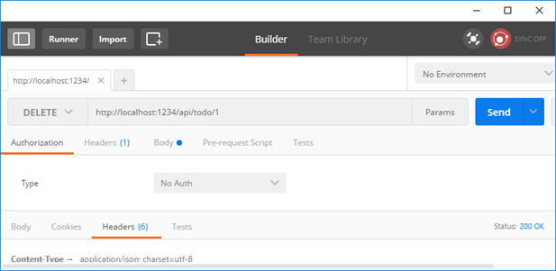

# Creating a Web API with ASP.NET Core

In this lab, you’ll build a web API for managing a list of "to-do" items. You won’t build a UI.

Here is the API that you’ll create:

| API | Description | Request | Body |
|---|---|---|---|
| `GET`  | `/api/todo` | Get all to-do items | None |
| `GET`  | `/api/todo/{id}` | Get an item by ID  | None |
| `POST` | `/api/todo`  |  Add a new item |  To-do item |
| `PUT` | `/api/todo/{id}` | Update an existing item | To-do item |
| `DELETE` | `/api/todo/{id}` | Delete an item | None |

The following diagram shows the basic design of the app.


- The client is whatever consumes the web API (mobile app, browser, etc). We aren’t writing a client in this tutorial. We'll use Postman or curlto test the app.
- A model is an object that represents the data in your application. In this case, the only model is a to-do item. Models are represented as C# classes, also know as Plain Old C# Object (POCOs).
- A controller is an object that handles HTTP requests and creates the HTTP response. This app will have a single controller.
- To keep the tutorial simple, the app doesn’t use a persistent database. Instead, it stores to-do items in an in-memory database.

## Create the project

From Visual Studio, select **File menu, > New > Project**.
Select the `ASP.NET Core Web Application (.NET Core)` project template. Name the project `TodoApi` and select **OK**.


In the **New ASP.NET Core Web Application (.NET Core) - TodoApi** dialog, select the **Web API** template. Select **OK**. Do not select **Enable Docker Support**.


### Launch the app

In Visual Studio, press <kbd>CTRL+F5</kbd> to launch the app. Visual Studio launches a browser and navigates to `http://localhost:port/api/values`, where port is a randomly chosen port number. If you're using Chrome, Edge or Firefox, the `ValuesController` data will be displayed:

```json
["value1","value2"]
```

If you're using IE, you are prompted to open or save the `values.json` file.

## Add support for Entity Framework Core

Install the **Entity Framework Core InMemory database provider** (`Microsoft.EntityFrameworkCore.InMemory` NuGet package). This database provider allows Entity Framework Core to be used with an in-memory database. 

## Add a model class

A model is an object that represents the data in your application. In this case, the only model is a to-do item.

Add a folder named `Models`. In _Solution Explorer_, right-click the project. Select **Add > New Folder**. Name the folder `Models`.

_Note: You can put model classes anywhere in your project, but the `Models` folder is used by convention._

Add a `TodoItem` class to the `Models` folder.

Replace the generated code with:

```csharp
namespace TodoApi.Models
{
    public class TodoItem
    {
        public long Id { get; set; }
        public string Name { get; set; }
        public bool IsComplete { get; set; }
    }
}
```

The database generates the `Id` when a `TodoItem` is insterted into the database table.

### Create the database context

The database context is the main class that coordinates Entity Framework functionality for a given data model. You create this class by deriving from the `Microsoft.EntityFrameworkCore.DbContext` class.

Add a `TodoContext` class in the `Models` folder.

```csharp
using Microsoft.EntityFrameworkCore;

namespace TodoApi.Models
{
    public class TodoContext : DbContext
    {
        public TodoContext(DbContextOptions<TodoContext> options)
            : base(options)
        {
        }

        public DbSet<TodoItem> TodoItems { get; set; }
    }
}
```

### Register the database context

In order to inject the database context into the controller, we need to register it with the dependency injection container. 

Register the database context with the service container using the built-in support for dependency injection. Replace the contents of `Startup.cs` with:

```csharp
using Microsoft.AspNetCore.Builder;
using Microsoft.AspNetCore.Hosting;
using Microsoft.EntityFrameworkCore;
using Microsoft.Extensions.Configuration;
using Microsoft.Extensions.DependencyInjection;
using Microsoft.Extensions.Hosting;
using TodoApi.Models;

namespace TodoApi
{
    public class Startup
    {
        public Startup(IConfiguration configuration)
        {
            Configuration = configuration;
        }

        public IConfiguration Configuration { get; }

        // This method gets called by the runtime. Use this method to add services to the container.
        public void ConfigureServices(IServiceCollection services)
        {
            services.AddControllers();
            services.AddDbContext<TodoContext>(opt => opt.UseInMemoryDatabase("TodoDatabase"));
        }

        // This method gets called by the runtime. Use this method to configure the HTTP request pipeline.
        public void Configure(IApplicationBuilder app, IWebHostEnvironment env)
        {
            if (env.IsDevelopment())
            {
                app.UseDeveloperExceptionPage();
            }

            app.UseHttpsRedirection();

            app.UseRouting();

            app.UseAuthorization();

            app.UseEndpoints(endpoints =>
            {
                endpoints.MapControllers();
            });
        }
    }
}
```

The preceding code snippet:
- Removes the code we're not using.
- Specifies an in-memory database is injected into the service container.

## Add a controller
In _Solution Explorer_, right-click the `Controllers` folder. Select **Add > New Item**. In the _Add New Item_ dialog, select the **Web API Controller Class** template. Name the class `TodoController`.


Replace the generated code with the following:

```csharp
using System.Collections.Generic;
using Microsoft.AspNetCore.Mvc;
using TodoApi.Models;
using System.Linq;

namespace TodoApi.Controllers
{
    [Route("api/[controller]")]
    public class TodoController : Controller
    {
        private readonly TodoContext _context;

        public TodoController(TodoContext context)
        {
            _context = context;

            if (_context.TodoItems.Count() == 0)
            {
                _context.TodoItems.Add(new TodoItem { Name = "Item1" });
                _context.SaveChanges();
            }
        }       
    }
}
```

The preceding code snippet:
- Defines an empty controller class. In the next sections, we'll add methods to implement the API.
- The constructor uses Dependency Injection to inject the database context (`TodoContext`) into the controller. The database context is used in each of the CRUD methods in the controller.
- The constructor adds an item to the in-memory database if one doesn't exist.

## Getting to-do items
To get to-do items, add the following methods to the `TodoController` class.

```csharp
[HttpGet]
public IEnumerable<TodoItem> GetAll()
{
    return _context.TodoItems.ToList();
}

[HttpGet("{id}", Name = "GetTodo")]
public IActionResult GetById(long id)
{
    var item = _context.TodoItems.FirstOrDefault(t => t.Id == id);
    if (item == null)
    {
        return NotFound();
    }
    return new ObjectResult(item);
}
```

These methods implement the two GET methods:
- `GET /api/todo`
- `GET /api/todo/{id}`

Here is an example HTTP response for the `GetAll` method:

```http
HTTP/1.1 200 OK
Content-Type: application/json; charset=utf-8
Server: Microsoft-IIS/10.0
Date: Thu, 18 Jun 2015 20:51:10 GMT
Content-Length: 82

[{"Key":"1", "Name":"Item1","IsComplete":false}]
```

Later in the tutorial we'll show how you can view the HTTP response using Postman or curl.

### Routing and URL paths
The [HttpGet] attribute specifies an HTTP GET method. The URL path for each method is constructed as follows:

- Take the template string in the controller’s route attribute:

```csharp
namespace TodoApi.Controllers
{
    [Route("api/[controller]")]
    public class TodoController : Controller
    {
        private readonly TodoContext _context;
```

- Replace "`[Controller]`" with the name of the controller, which is the controller class name minus the "`Controller`" suffix. For this sample, the controller class name is `TodoController` and the root name is "`todo`". ASP.NET Core routing is not case sensitive.
- If the `[HttpGet]` attribute has a route template (such as `[HttpGet("/products")]`, append that to the path. This sample doesn't use a template. See [Attribute routing with Http[Verb] attributes](https://docs.microsoft.com/en-us/aspnet/core/mvc/controllers/routing#attribute-routing-with-httpverb-attributes) for more information.

In the `GetById` method:
```csharp
 [HttpGet("{id}", Name = "GetTodo")]
public IActionResult GetById(long id)
```

"`{id}`" is a placeholder variable for the ID of the todo item. When `GetById` is invoked, it assigns the value of "`{id}`" in the URL to the method's id parameter.

`Name = "GetTodo"` creates a named route and allows you to link to this route in an HTTP Response. I'll explain it with an example later. See [Routing to Controller Actions](https://docs.microsoft.com/en-us/aspnet/core/mvc/controllers/routing) for detailed information.

### Return values
The `GetAll` method returns an `IEnumerable`. MVC automatically serializes the object to JSON and writes the JSON into the body of the response message. The response code for this method is `200`, assuming there are no unhandled exceptions. (Unhandled exceptions are translated into `5xx` errors.)

In contrast, the `GetById` method returns the more general `IActionResult` type, which represents a wide range of return types. `GetById` has two different return types:

- If no item matches the requested ID, the method returns a `404` error. This is done by returning `NotFound`.
- Otherwise, the method returns `200` with a JSON response body. This is done by returning an `ObjectResult`

### Launch the app
In Visual Studio, press <kbd>CTRL+F5</kbd> to launch the app. Visual Studio launches a browser and navigates to `http://localhost:port/api/values`, where port is a randomly chosen port number. If you're using Chrome, Edge or Firefox, the data will be displayed. If you're using IE, IE will prompt to you open or save the values.json file. Navigate to the `Todo` controller we just created `http://localhost:port/api/todo`.

## Implement the other CRUD operations
We'll add `Create`, `Update`, and `Delete` methods to the controller. These are variations on a theme, so we'll just show the code and highlight the main differences. Build the project after adding or changing code.

### Create

```csharp
[HttpPost]
public IActionResult Create([FromBody] TodoItem item)
{
    if (item == null)
    {
        return BadRequest();
    }

    _context.TodoItems.Add(item);
    _context.SaveChanges();

    return CreatedAtRoute("GetTodo", new { id = item.Id }, item);
}
```

This is an `HTTP POST` method, indicated by the `[HttpPost]` attribute. The `[FromBody]` attribute in the parameters tells MVC to get the value of the to-do item from the body of the HTTP request.

The `CreatedAtRoute` method returns a `201` response, which is the standard response for an `HTTP POST` method that creates a new resource on the server. `CreatedAtRoute` also adds a `Location` header to the response. The `Location` header specifies the URI of the newly created to-do item. See [10.2.2 201 Created](http://www.w3.org/Protocols/rfc2616/rfc2616-sec10.html).

### Use Postman to send a Create request

The **Postman** aplication can be obtained on the [getpostman.com](https://www.getpostman.com/) website. As an alternative, there is also an online tool available, named [Postwoman](https://postwoman.io), which does roughly the same from your browser.


- Set the **HTTP method** to `POST`
- Select the **Body** radio button
- Select the `raw` radio button
- Set the type to `JSON`
- In the key-value editor, enter a Todo item such as

```json
{
    "name":"walk dog",
    "isComplete":true
}
```

- Select **Send**
- Select the **Headers** tab in the lower pane and copy the `Location` header:


You can use the `Location` header URI to access the resource you just created. Recall the `GetById` method created the "`GetTodo`" named route:

```csharp
[HttpGet("{id}", Name = "GetTodo")]
public IActionResult GetById(long id)
```

### Update

```csharp
[HttpPut("{id}")]
public IActionResult Update(long id, [FromBody] TodoItem item)
{
    if (item == null || item.Id != id)
    {
        return BadRequest();
    }

    var todo = _context.TodoItems.FirstOrDefault(t => t.Id == id);
    if (todo == null)
    {
        return NotFound();
    }

    todo.IsComplete = item.IsComplete;
    todo.Name = item.Name;

    _context.TodoItems.Update(todo);
    _context.SaveChanges();
    return new NoContentResult();
}
```

`Update` is similar to `Create`, but uses `HTTP PUT`. The response is [`204 No Content`](http://www.w3.org/Protocols/rfc2616/rfc2616-sec9.html). According to the HTTP spec, a `PUT` request requires the client to send the entire updated entity, not just the deltas. To support partial updates, use `HTTP PATCH`.


### Delete

```csharp
[HttpDelete("{id}")]
public IActionResult Delete(long id)
{
    var todo = _context.TodoItems.FirstOrDefault(t => t.Id == id);
    if (todo == null)
    {
        return NotFound();
    }

    _context.TodoItems.Remove(todo);
    _context.SaveChanges();
    return new NoContentResult();
}
```

The response is `204 No Content`.
 


# If time permits...

## Creating your own API and application for Bethany's Pie Shop

In this lab, you’ll need to create an API yourself as well as consume it from a `Console` application. Here’s what you need to do:

- Create a model for Bethany’s Pie Shop
    - Take a look at the completed application in the demos.
    - Use a simplified model with just `Pie` and `Category`.
    - You can use the `Mock` versions of the repos or alternatively, create the database using EF Core or use the in-memory database provider again.
- Create an API that supports
    - Listing all pies including their category
    - Adding a Pie (including validation)
    - Editing a Pie
    - Removing a Pie
    - Listing all categories
- Create a console application that offers the user the ability to 
    - Get an overview of all pies
    - Enter a new Pie
    - Edit an existing pie
        - The user will now first need to select a Pie
    - Delete a Pie
        - The user will now first need to select a Pie
    - Get an overview of all Categories 
- Note that you can use **Postman** also to test your API calls!
